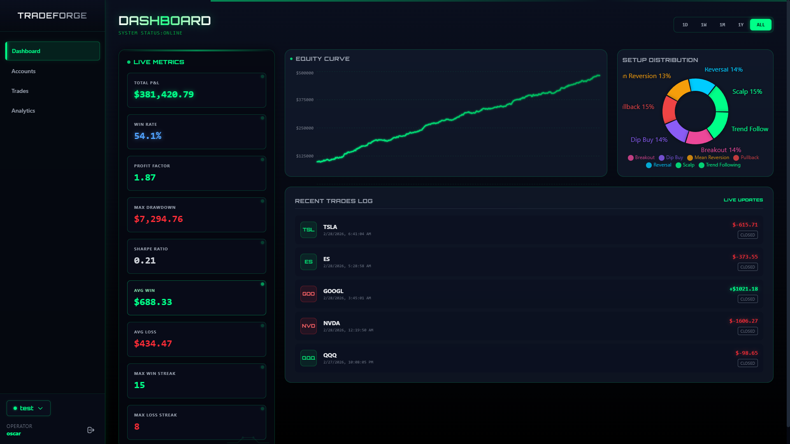
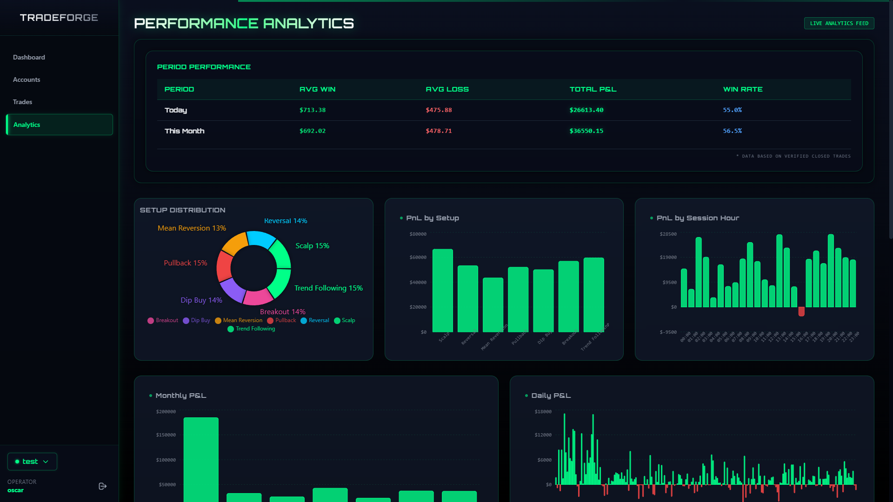
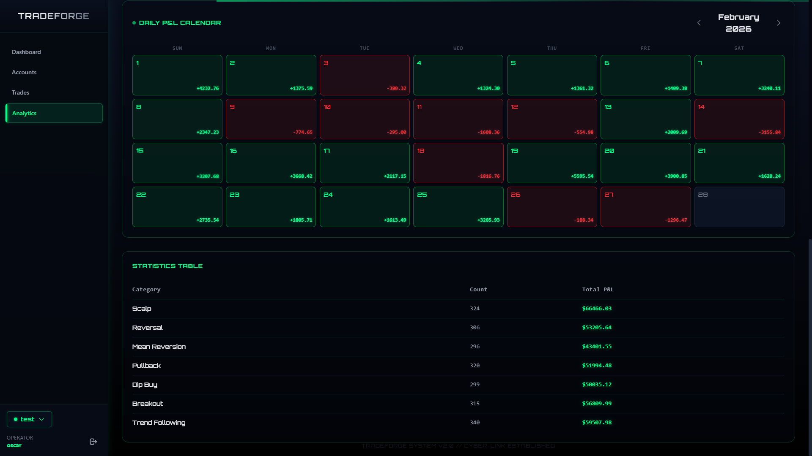
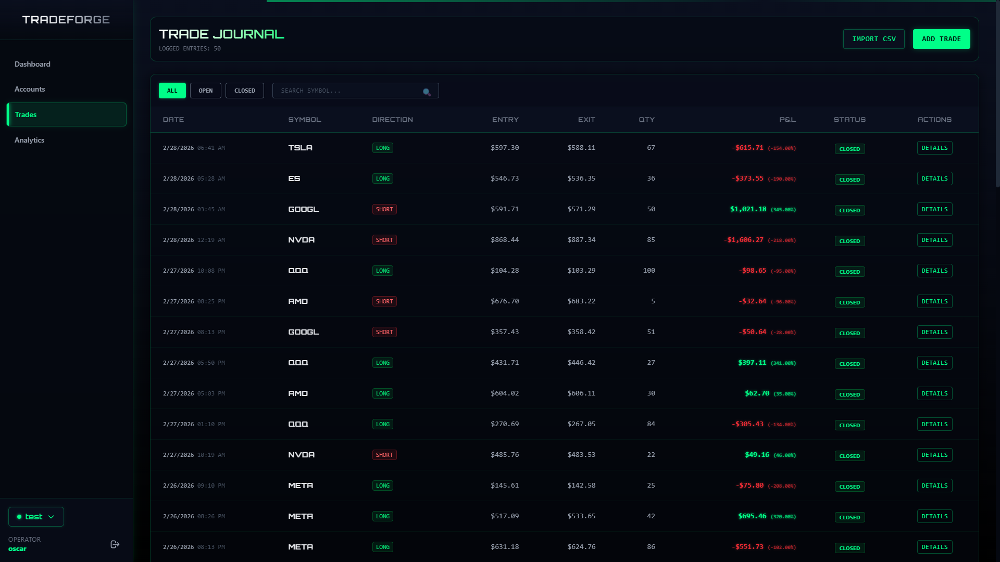
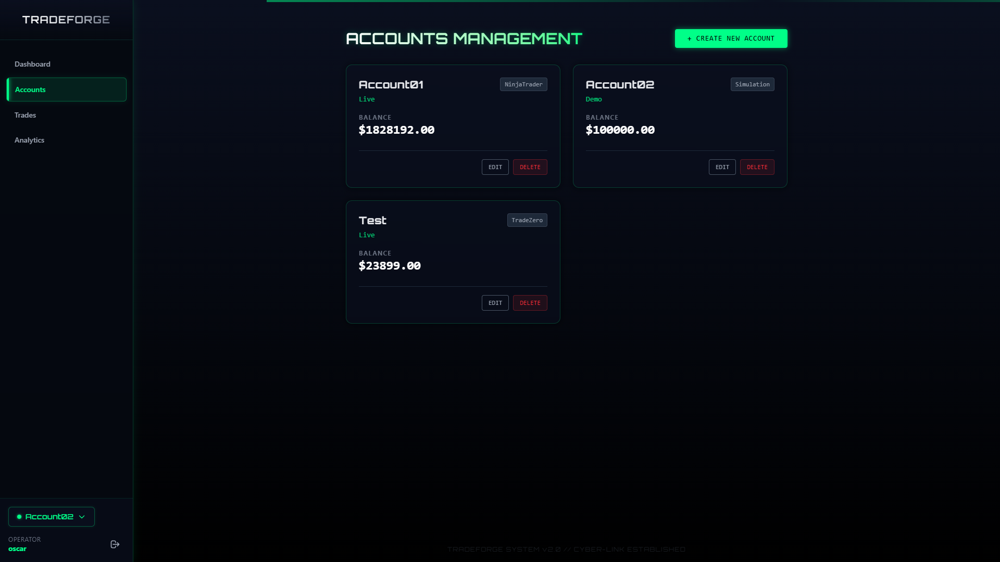
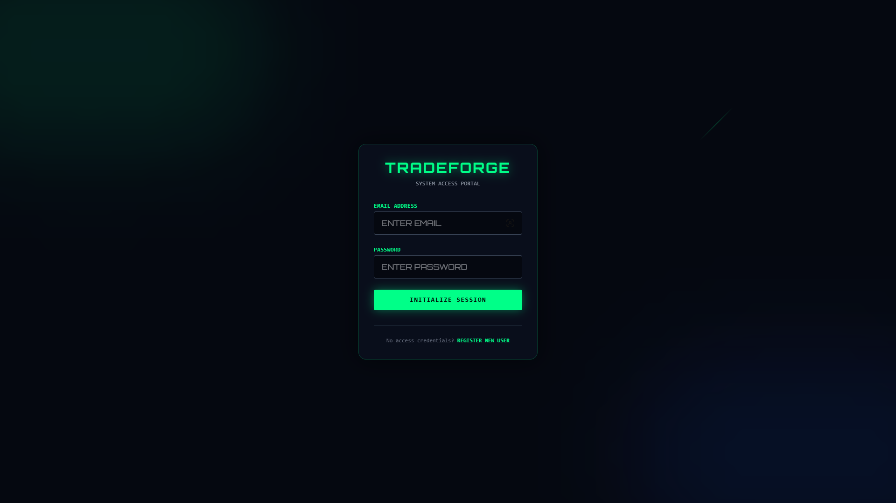

#  TradeForge

TradeForge is a high-performance trading journal and performance analytics platform. Elevate your trading strategy with real-time metrics, advanced data visualization, and an immersive neon-aesthetic interface.

---

## Visual Gallery



<!-- slide -->

<!-- slide -->

<!-- slide -->

<!-- slide -->

<!-- slide -->



## Key Features

### Interactive Dashboard
- **Live Metrics**: Real-time tracking of Net P&L, Profit Factor, Win Rate, and Avg Trade.
- **Equity Curve**: Dynamic visualization of account growth over time.
- **Setup Distribution**: Quick breakdown of which strategies are driving your performance.
- **Time Range Filtering**: Seamlessly toggle between 1D, 1W, 1M, 1Y, and ALL time views.

### Performance Analytics
- **P&L by Setup**: Granular analysis of each trading strategy's profitability.
- **Session Analytics**: Analyze performance by session hour to find your "Golden Hour".
- **Monthly/Daily Breakdown**: Track consistency with detailed periodic bar charts.
- **Daily Heatmap**: Visual calendar showcasing winning and losing streaks.

### Advanced Trade Journal
- **Digital Logbook**: Immersive log of all trade entries and exits.
- **Symbol Tracking**: Automatic color-coded direction (Long/Short) and status (Open/Closed) indicators.
- **Signal Feed**: Scroll through recent trade history with precise P&L attribution.

### Account Management
- **Multi-Account Support**: Manage multiple trading accounts from a single interface.
- **Capital Tracking**: Track initial capital vs. current equity.

---

## Statistical Intelligence

TradeForge automatically calculates complex trading metrics to provide actionable insights:

| Metric | Description |
| :--- | :--- |
| **Profit Factor** | Ratio of gross profit to gross loss. |
| **Win Rate** | Percentage of winning trades over total closed trades. |
| **Max Drawdown** | Peak-to-trough decline during a specific period. |
| **Expectancy** | The average amount you can expect to win (or lose) per trade. |
| **Avg RR** | Average Risk-to-Reward ratio across all setups. |

---

## Technical Stack

- **Frontend**: React, TypeScript, Tailwind CSS (Custom Neon Theme), Recharts, Orbitron Typography.
- **Backend**: Node.js, Express, TypeScript.
- **State Management**: Zustand.
- **Persistence**: PostgreSQL.

---

## API Reference

The TradeForge backend providing a RESTful API for all trading operations.

### Base URL
`http://localhost:5000/api`

### Endpoints

| Category | Endpoint | Method | Description |
| :--- | :--- | :--- | :--- |
| **Auth** | `/auth/register` | POST | Register a new user account. |
| | `/auth/login` | POST | Authenticate user and receive token. |
| | `/auth/me` | GET | Retrieve current authenticated user profile. |
| **Accounts** | `/accounts` | POST | Create a new trading account. |
| | `/accounts` | GET | List all trading accounts for the user. |
| | `/accounts/:id` | GET | Get details of a specific account. |
| | `/accounts/:id` | PUT | Update account information (name, capital, etc.). |
| | `/accounts/:id` | DELETE | Remove an account and its associated trades. |
| **Trades** | `/trades` | POST | Log a new execution or trade entry. |
| | `/trades` | GET | Fetch trade history with optional filtering. |
| | `/trades/:id` | GET | Retrieve internal data for a specific trade. |
| | `/trades/:id` | PUT | Update trade parameters (symbol, size, price). |
| | `/trades/:id/close` | PATCH | Close an open position and calculate P&L. |
| | `/trades/:id` | DELETE | Remove a trade from the journal. |
| | `/trades/import` | POST | Batch import trades via CSV file upload. |
| **Analytics** | `/analytics/summary` | GET | Holistic performance overview (Win Rate, P&L). |
| | `/analytics/daily` | GET | Daily performance breakdown for charts. |
| | `/analytics/monthly` | GET | Monthly consistency and aggregation metrics. |
| | `/analytics/by-setup` | GET | Profitability breakdown by trading strategy. |
| | `/analytics/by-session` | GET | Performance analysis grouped by session hours. |
| | `/analytics/equity-curve`| GET | Time-series data for account growth visualization. |
| **System** | `/health` | GET | Check server and database connectivity status. |

---

## Getting Started

### Prerequisites
- Node.js (v18+)
- npm

### Installation

1. **Clone the repository**
   ```bash
   git clone https://github.com/your-username/TradeForge.git
   cd TradeForge
   ```

2. **Frontend Setup**
   ```bash
   cd TradeForge-FrontEnd
   npm install
   npm run dev
   ```

3. **Backend Setup**
   ```bash
   cd ../TradeForge-BackEnd
   npm install
   # Configure .env based on .env.example
   npm run dev
   ```

---


